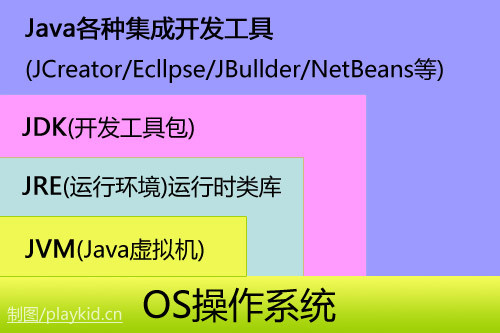

###### JVM含义(基于堆栈的虚拟机)

https://blog.csdn.net/songkai320/article/details/51819046



老刘讲编程(线程)

https://segmentfault.com/a/1190000004694556?utm_source=tag-newest

纯源码解析

http://vip.iocoder.cn/

#### 装载类

1. 根据表格找到Account.class

2. **文件验证器** 检查Account.class字节码是否规范

3. Bootstrap Classloader

   Extension Classloader

   App Classloader 将.class类帶到虚拟机

4. .class字节码进入方法区大楼

5. 线程x3704远程视频Account.class字节码,在一个工作台上调用第二个方法

6. 线程在柜子中[堆中的局部变量表]取数据压入桶[栈]中,线程工作就是向桶中压入/弹出数据进行处理

7. 每个线程也有一个桶[java栈],里面有多层工作台(方法),工作台(方法)任务处理完就销毁,线程只处理最上层的工作台

8. 堆大楼中有局部变量表,存放了根据.class创建的对象示例,经过 可达性分析(GC判断对象是不是垃圾)将垃圾销毁

9. javac工具按照Account.java创建Account.class,覆盖原来的类文件


#### 装配工(Java Server Page 没落)

1. JSP装配工的工作是将页面模板和数据装配在一起
2. 用<% %>包裹起来代码进行装配
3. Servlet当控制器, Java类当模型, 视图是JSP
4. 用JSTL[JSP Standard Tag Library]封装控制语句给程序员调用
5. 来了两个新家伙, Freemaker和Velocity装配HTML页面
6. 这两个人可以脱离web环境使用,作为代码模板和动态页面静态化[先读取数据缓存下来,使用时直接返回]
7. 页面装配工作越来越差,因为JavaScript通过AJAX异步的http调用java后台接口获得JSON数据
8. 直接在浏览器把模板和数据装配起来,前后端分离的时代来临了


JDK动态代理

1. 运行时对类做出修改,如日志和事务
2. 声明式编程,在xml文件中声明了需要加强的类和方法以及加强的代码,要求将加强的代码动态插入需要加强的类和方法
3. 必须有接口,才能使用动态代理
4. 动态的生成新类(代理),在新类的基础上进行修改
5. LoggerHandler加强的代码需要继承InvocationHandler接口,实现invoke(Object proxy, Method method, Object[] args)

``````java
public class LoggerHandler implements InvocationHandler{
    
    private Object target; //需要加强的类
    
    public LoggerHandler(Object target){
        this.target = target;
    }
    
    public Object invoke(Object proxy, Method method, Object[] args) throws Throwable{
        
        Logger.startLog();
        Object result = method.invoke(target ,ages);//通过反射执行需要加强类的方法
        Logger.endLog();
        
        return result;
    }
}
``````


1. 