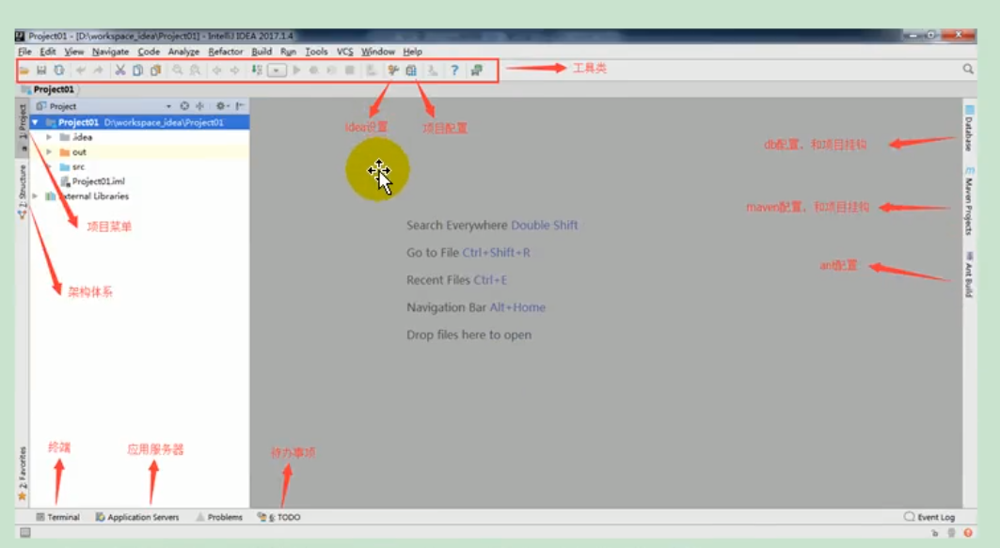
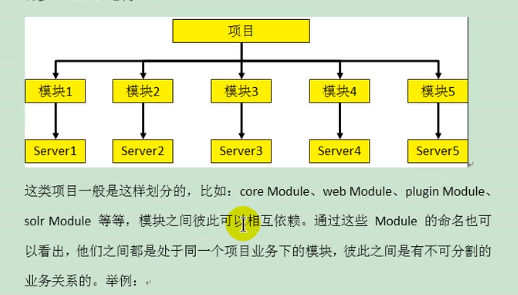
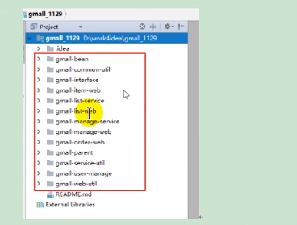
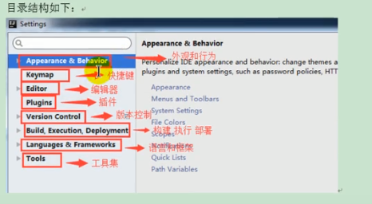
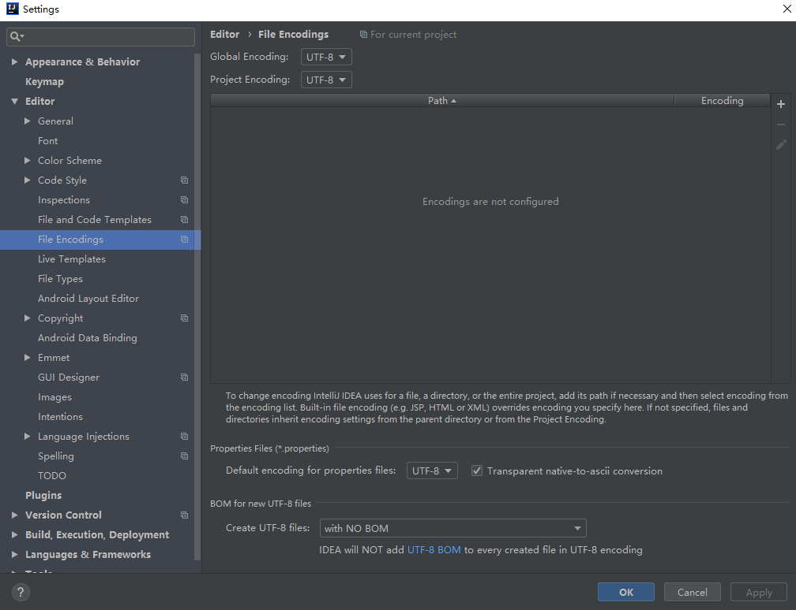

# Intellij IDEA 集成开发工具

## 1.下载安装IDEA

- 1. 官网下载(2018.2 2018年的第二个版本)

- 2. 安装jdk8
- 3. 指定安装目录(不包含中文和空格键)
- 4. 选择安装的64位,不用勾选.java等等(是指已.java结尾的文件用idea打开)

### 安装目录结构

- 安装目录下

  - bin

    - idea64.exe(64位的运行程序)

    - idea64.exe.vmoptions(虚拟机配置信息)

      如果是64位16G内存的电脑,需要开发大型程序,可以修改下列配置提高流畅性

      -Xms128m	-> 500m(初始内存数,提高idea启动速度)
      -Xmx750m	->1500m(最大内存数,降低垃圾回收的频率)
      -XX:ReservedCodeCacheSize=240m	->500m(保留代码缓存大小,降低代码回收的频率)
      -XX:+UseConcMarkSweepGC
      -XX:SoftRefLRUPolicyMSPerMB=50
      -ea
      -Dsun.io.useCanonCaches=false
      -Djava.net.preferIPv4Stack=true
      -Djdk.http.auth.tunneling.disabledSchemes=""
      -XX:+HeapDumpOnOutOfMemoryError
      -XX:-OmitStackTraceInFastThrow
      -javaagent:G:/JetbrainsCrack.jar

  - help

  - jre64(运行java程序绑定了jre)

  - lib

  - license(插件的许可信息)

  - plugins(插件)
### 设置目录结构

- c:/用户/Administrator/.IntelliJIdea2018.2
  - config
    - file Templates(文件模板)
    - keymaps(快捷键)
    - plugins
  - system(系统目录)
    - caches(缓存和索引)

## 2.卸载IDEA

- 1. 在c:/用户/Administrator/.IntelliJIdea2018.2目录下保存着idea的配置文件和缓存
- 2. 控制面板 -> 卸载 -> 选中卸载缓存设置和插件
- 3. 卸载开发工具不会将开发的程序卸载掉


## 3.启动IDEA

- 上网找激活码激活IDEA
- 选择主题
- 选择插件(可不选)
- create new Project
  - 指定项目类型(可不选)
  - 设置project name和project location

  

#### 创建模块(module)





​	右击项目 ->  new Module -> 指定项目类型(可不选) -> 设置Module name,Content root和Module file location

#### 删除模块(module)

​	右击模块 -> Open Module Settings -> 选择"-"减号移除Module

​	右击模块 -> delete


###### idea 项目删除

- 右击项目 -> model project -> OK
- 关闭项目 -> 找到项目在计算机上目录 -> 删除

## 3.配置IDEA

**Settings**  (ctrl + alt + s)



- **主题**   Appearance & Behavior

  - Appearance(外观) -> Theme(窗口主题)

- **Editor**

  - General 
    **滚轮改变字体**-> Change font size (Zoom) with Ctrl + Mouse Wheel [通过ctrl+鼠标滚轮 改变字体大小]
    **悬浮提示**     -> Show quick documentation on mouse move Delay(ms):1000 [鼠标悬停1秒显示对应的文档说明

       - **自动导包**    Auto Import -> Insert import on paste:All [自动导包Alt + Entry 快捷键手动导包]
        -> Add unambiguous imports on the fly			[勾选，即时添加明确的导入]
        -> Optimize imports on the fly (for current project)	[勾选，即时优化导入（针对当前项目）]

    - **显示行号和分隔符**  Appearance[外貌]    -> show line numbers [显示行号]

      -> show method separatros[显示方法分隔符, 方法间添加一条横线]

    - **提示忽略大小写**    Code Completion 

      ​	-> Case sensitive completions -> 选为  None

      或者是 -> Match case [解除勾选]

    - **多行显示打开的文件名**  Editor Tabs ->  show tabs in one row -> 去掉选中

  - **设置字体和大小间距**  Font  

  - Color Scheme(颜色方案)

    ​	 -> **主题** Scheme (主题) [http://www.riaway.com搜索主题下载对应jar包]

    ​	下载好主题后可以File -> import settings导入jar包

    或者在 Scheme (主题) 设置import scheme

    - **设置注释字体颜色** Language Defaults -> comments

  - File and Code Templates(代码文件模板)

    -> **设置注释头**  Includes   ->  File Header

    ```java
    /**
    @author chenyue
    @create ${YEAR}-${MONTH}-${DAY} ${TIME}
    */    
    ```

  - File Encodings  (文件编码)

    

  - Live Templates (设置模板,例: psvm或者main)

    ``````java
    //常用模板
    //模板1 : psvm		main方法
    public static void main(String[] args){}
    
    //模板2 : sout		输出
    System.out.println();
    //sout变形  soutp / soutm / soutv /  xxx.sout
    System.out.println("args = [" + args + "]");// soutp ： 打印方法形式参数
    System.out.println("HelloWord.main");	// soutm ： 打印方法名称
    String name = "张三";
    System.out.println("name = " + name);	// soutv ： 打印变量
    name.sout  ---->>>> System.out.println(name); // xxx.sout ： 打印变量
    
    //模板3 : fori		for循环
    for (int i = 0; i < arr.length; i++) {}
    //fori变形	iter  /  itar
    for (String s : arr) {}	// iter	:  增强for循环
    for (int i = 0; i < arr.length; i++) {String s = arr[i];}	//  itar  :  普通for循环赋值
    
    //模板4 : list.for	list的for循环
    for (int i : list) {}
    //list.for变形	list.fori  /  list.forr
    for (int i = 0; i < ints.size(); i++) {}	//list.fori  : 普通for循环
    for (int i = ints.size() - 1; i >= 0; i--) { }	//list.forr  : 倒叙
    
    //模板5 : ifn	  条件判断
    if (ints == null) {}
    //ifn变形 inn / xxx.null / xxx.nn
    if (ints != null) {}// inn  : 条件判断 
    if (ints == null) {}// xxx.null  : 条件判断 
    if (ints != null) {}// xxx.nn  : 条件判断 
    
    //模板6 : prsf	private static final
    //psf	public static final
    //psfi	public static final int
    //psfs	public static final String
    
    //修改和自定义模板
    修改 :  Live Templates -> other -> psvm 修改为 main
    修改 :  public static final int $VAR1$ = $VAR2$;	$END$	$VAR1$,使用entry确定光标位置
    添加模板组 : Template Group    命名为 : custom
    添加模板   : Live Template	   private String $VAR1$ = $VAR2$;$END$  
    	No applicable contexts yet. Define  -> 点击Define 选中 Java
    ``````

    或者

  - Editor
    - General
      - Postfix conpletion

  ​	

- Build,Execution,Deployment

  - Compiler

    -> **设置自动编译**  Build project automatically  -->  勾选

    ->   Compile independent modules in parallel  -->  勾选

- Keymap(快捷键)

|                      | 光标左右移动                   | shift 选中       |
| -------------------- | ------------------------------ | ---------------- |
| **Ctrl+ 左右**       | 光标不选择                     | 光标移动一个单词 |
| **Ctrl+Shift+ 左右** | 光标选中                       |                  |
| **左右**             | 光标不选择                     | 光标移动一个字母 |
| **Alt+ 左右**        | 同时打开多个文件时切换代码视图 |                  |
| **Ctrl+Alt+ 左右**   | 返回至上次浏览的位置           |                  |
| **Shift+ 左右**      | 光标选中                       |                  |
| **Shift+ 左右**      | 光标选中                       |                  |


|                      | 光标上下移动       | shift 选中                         |
| -------------------- | ------------------ | ---------------------------------- |
| **Ctrl+ 上下**       | 光标不移动         | 屏幕上下移动                       |
| **Ctrl+Shift+ 上下** | 一系列代码上下移动 | 如光标放到方法上，整个代码上下移动 |
| **Alt+Shift+ 上下**  | 一行代码上下移动   |                                    |
| **Shift+ 上下**      | 光标选中           |                                    |


| **ctrl+ alt+entry**  | 光标无论在哪里，向上插入一空行     |      |
| -------------------- | ---------------------------------- | ---- |
| **shift+ entry**     | **光标无论在哪里，向下插入一空行** |      |
| **ctrl+Shift+Enter** | 自动补全分号                       |      |
| **Ctrl+D**           | **复制这一行代码到下一行**         |      |
| **Ctrl+Y**           | **删除一行**                       |      |

| **Alt+/**        | 复制上一个单词/ 报错时自动补全                               |      |
| ---------------- | ------------------------------------------------------------ | ---- |
| **Ctrl+/**       | **设置/取消  单行注释  //**                                  |      |
| **Ctrl+Shift+/** | **设置/取消  多行注释  /*   */**                             |      |
| **Alt+Enter**    | 引入类或提供给你选择的处理方法(万能解错)/ **生成返回值变量** |      |
|                  |                                                              |      |
| **Ctrl+Z**       | **撤销操作**                                                 |      |
| **Ctrl+Shift+Z** | **恢复Ctrl+Z撤销的操作**                                     |      |
| **ctrl+Insert**  | **get/set方法**                                              |      |
| Ctrl+W           | 选中代码，连续按会有其他效果                                 |      |
| Alt+Shift+V      | 粘贴板历史                                                   |      |

**查找相关的快捷键**

| **Ctrl+F**       | 在本文件查找，可通过方向键移动选择 | 按Esc消失                                                    |
| ---------------- | ---------------------------------- | ------------------------------------------------------------ |
| **Ctrl+Shift+F** | 在制定路径/模块/工程内查找         | 非常常用的一个功能，很多时候你想查找一个内容但是不一定知道它在哪里，这个就很实用 |
| Ctrl+R           | 在本文件内查找/替换                | 按Esc消失                                                    |
| Ctrl+N           | 在本工程类查询某个类               |                                                              |
| Ctrl+Shift+N     | **查询某个类(不限本工程)**         | 看源码很实用，比如我想看看jdk里面TreeMap这个类的代码，就可以用这个功能 |

**查看代码相关的快捷键**

| 快捷键             | 功能                           | 说明                                                       |
| ------------------ | ------------------------------ | ---------------------------------------------------------- |
| **Ctrl+H**         | **查看一个类的继承关系**       |                                                            |
| Ctrl+B             | 查看一个类或者变量的申明       |                                                            |
| **Alt+F7**         | 查找一个属性或方法被谁调用     |                                                            |
| Alt+上下           | 跳到上/下一个方法(或属性)      |                                                            |
| Ctrl+Shift+u       | 字母大小写                     |                                                            |
| Alt+左右           | 同时打开多个文件时切换代码视图 |                                                            |
| **Ctrl+Alt+ 左右** | 返回至上次浏览的位置           | 非常实用，在多个文件代码中遨游的时候能够快速回到想去的位置 |
| Ctrl+上下          | 光标跳转到第一行或最后一行     |                                                            |
| ALT+SHIFT+C        | 最近修改的代码                 |                                                            |

**提示类的快捷键**

| 快捷键     | 功能         | 说明 |
| ---------- | ------------ | ---- |
| Ctrl+Q     | 显示注释文档 |      |
| **Ctrl+P** | 查看函数参数 |      |
| Ctrl+J     | 代码模板     |      |

**重构类快捷键**

| 快捷键       | 功能                           | 说明           |
| ------------ | ------------------------------ | -------------- |
| Alt+Delete   | 安全删除字段或方法             |                |
| Ctrl+Alt+N   | 去除一些多余的赋值过程或者函数 | 下面会单独演示 |
| **Shift+F6** | 重命名类或者变量               |                |

**编译器相关快捷键**

| 快捷键  | 功能           | 说明 |
| ------- | -------------- | ---- |
| Alt+F12 | 打开命令行终端 |      |
| Alt+1   | 打开工程结构   |      |
| Alt+7   | 打开类结构     |      |
| Alt+9   | 打开change     |      |


## 4.创建静态或动态的Project和Module

## 5.版本控制(Git)

- 先下载git的工具

- setting -> version Control -> git 指定安装目录 Path to Git executable: F:\Git\bin\git.exe

- setting -> version Control -> GitHub 添加github账号

- VCS -> checkout from version Control -> git

## 6.断点调试
debug

　　　　> Show Execution Point (Alt + F10)：如果你的光标在其它行或其它页面，点击这个按钮可跳转到当前代码执行的行。

　　　　> Step Over (F8)：步过，一行一行地往下走，如果这一行上有方法不会进入方法。

　　　　> Step Into (F7)：步入，如果当前行有方法，可以进入方法内部，一般用于进入自定义方法内，不会进入官方类库的方法，如第25行的put方法。

　　　　> Force Step Into (Alt + Shift + F7)：强制步入，能进入任何方法，查看底层源码的时候可以用这个进入官方类库的方法。

　　　　> Step Out (Shift + F8)：步出，从步入的方法内退出到方法调用处，此时方法已执行完毕，只是还没有完成赋值。

　　　　> Drop Frame (默认无)：回退断点，后面章节详细说明。

　　　　> Run to Cursor (Alt + F9)：运行到光标处，你可以将光标定位到你需要查看的那一行，然后使用这个功能，代码会运行至光标行，而不需要打断点。

　　　　> Evaluate Expression (Alt + F8)：计算表达式，后面章节详细说明。

## 7.生成javadoc, 清理缓存和索引,关闭自动更新,插件

- javadoc : tools -> generate javadoc -> 

​	output directory -> 目录

​	locale -> zh_CN 语言中文

​	Other command line arguments -> UTF-8 -charset UTF-8 -windowwtitle "test" 

- 清理缓存 file -> invalidate caches/restrat

  会删除本地的localHistory历史记录,可以将在c:/用户/Administrator/.IntelliJIdea2018.2/system/LoaclHistory文件复制拷贝出来,清理缓存后再拷贝进去

- 关闭自动跟新 

  settings -> appearance & Behavior -> System Settings -> Updates -> Automatically check updates 取消勾选

- https://plugin.jetbrains.com/ 官方插件库

  settings -> plugins 

  ​	install jetbrains plugin [从官方插件库安装插件]

  ​	browse repositories[从中央仓库下载]

  ​	install plugin from disk[从本地安装插件]
